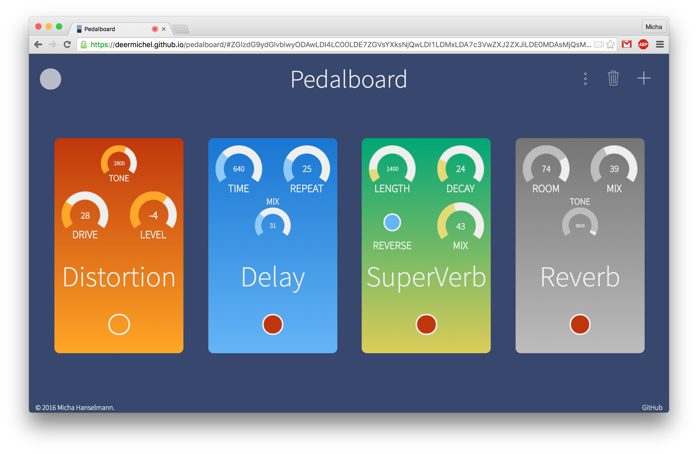

## Pedalboard

This is Pedalboard, a web live audio manipulation experiment.
Connect your guitar or mic to your computer using an audio interface.
Depending on your software and hardware configuration, there might be a
noticeable latency (remember - it's an experiment). For best results use
Google Chrome. *(To be honest, Chrome is the only browser supporting all
features without problems.* :smirk:*)*

### Third-party

* [jQuery](https://jquery.com/) ([MIT](https://github.com/jquery/jquery/blob/master/LICENSE.txt))
* [jQuery Knob](http://anthonyterrien.com/knob/) ([MIT](https://github.com/aterrien/jQuery-Knob/blob/master/LICENSE))
* [Tone.js](https://github.com/Tonejs/Tone.js) ([MIT](https://github.com/Tonejs/Tone.js/blob/master/LICENSE.md))
* [SoundCloud SDK](https://developers.soundcloud.com/) ([License](https://github.com/soundcloud/soundcloud-javascript/blob/master/LICENSE.md))
* [Recorder.js](https://github.com/mattdiamond/Recorderjs) ([MIT](https://github.com/mattdiamond/Recorderjs#license-mit))
* [Dropbox.js](https://github.com/dropbox/dropbox-js) ([MIT](https://github.com/dropbox/dropbox-js/blob/stable/LICENSE.txt))
* [qr.js](http://neocotic.com/qr.js/) ([GPL v3](https://github.com/neocotic/qr.js/blob/master/LICENSE.md))
* [Ionicons](http://ionicons.com/) ([MIT](https://github.com/driftyco/ionicons/blob/master/LICENSE))
